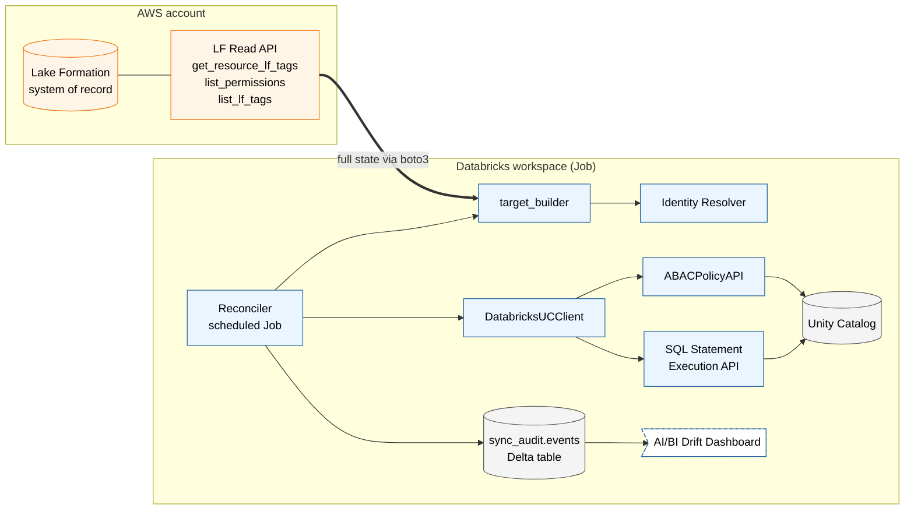

# High-level architecture

**Reconciler-only design.** The reconciler is the sole sync mechanism. On a
schedule (default 6h, configurable), it pulls the current Lake Formation state,
constructs a target UC state, diffs against the live UC, and applies corrective
ops. There is no event-driven path — worst-case sync SLA = reconciler interval.

The event-path code (`cloudtrail.py`, `orchestrator.py`) is preserved in the
repo but **not wired into the production Job**. Re-enable it later if a
customer ever requires sub-minute SLA.

## Reading the diagram

- **Orange** = AWS-managed. **Blue** = Databricks-managed. **Grey** = storage
  (UC + audit Delta). **Dashed outline** = consumer-facing surface (dashboard).
- The **double arrow (`==>`)** is the one cross-cloud hand-off: the
  `BotoLFReader` calls the LF Read API to build the target snapshot.

## Components by file

| Box on diagram                | Source file                                                          |
|---|---|
| Lake Formation, LF Read API   | (AWS-managed)                                                        |
| target_builder                | `src/entitlements_sync/target_builder.py`                            |
| Reconciler                    | `src/entitlements_sync/reconciler.py`                                |
| Identity Resolver             | `src/entitlements_sync/identity.py`                                  |
| DatabricksUCClient            | `src/entitlements_sync/databricks_uc.py`                             |
| SQL Statement Execution path  | `make_sdk_sql_runner` in `databricks_uc.py` (uses `databricks-sdk`)  |
| ABACPolicyAPI                 | `databricks_uc.LoggingABACPolicyAPI` (real REST impl is a TODO)      |
| BotoLFReader                  | `src/entitlements_sync/boto_lf_reader.py`                            |
| LFReader Protocol + Fake      | `src/entitlements_sync/lf_reader.py`                                 |
| sync_audit.events Delta table | `src/entitlements_sync/sql_audit.py` (`SQLAuditSink`)                |
| Job entry point               | `scripts/run_sync.py`                                                |
| AI/BI Drift Dashboard         | (dashboard JSON — separate, fed by `sync_audit.events`)              |

## Sync loop in detail

1. Databricks Job fires (cron schedule, e.g., every 6h).
2. `scripts/run_sync.py` loads `config.yaml`, constructs `BotoLFReader`,
   `DatabricksUCClient`, `SQLAuditSink`, `IdentityResolver`.
3. `build_target_state(reader, resolver, tag_namespace_map)` walks the
   in-scope resources, calls LF for tags + grants, resolves principals, applies
   namespace map, materializes one policy per LF-Tag key. Returns
   `TargetUCState`.
4. `Reconciler(uc, audit).reconcile(target)`:
   - For each `managed_resource`, diff desired vs actual UC tags, grants,
     policies.
   - Missing in UC → apply, audit row tagged `reconciler:missing`.
   - Unexpected in UC on a `managed_by=lf_sync` object → revert, audit row
     tagged `reconciler:drift`.
   - In-sync resources produce no ops.
5. Returns a `ReconcileReport` (missing_ops, drift_ops, audit_rows_written).
   Logged + visible in the AI/BI dashboard.

## Why reconciler-only

- **One moving part to operate.** No Lambda, no EventBridge rule, no SQS DLQ
  monitoring. One Databricks Job, one schedule, one log.
- **Strong correctness story.** Full-state diff every interval — no class of
  "missed event" bugs.
- **Acceptable latency for the CPP MD.** The objection was "manual
  re-entry," not "sub-minute SLA." Minutes-to-hours of sync lag with
  guaranteed convergence is sufficient.
- **Cheaper.** One serverless SQL warehouse spin-up per cycle vs. always-on
  Lambda+SQS.

If a future customer requires sub-minute SLA, the preserved event-path code
(`cloudtrail.py`, `orchestrator.py`) plugs in front of the reconciler, which
then becomes the safety net it was originally specified as in the design doc.

## What this diagram deliberately omits

- **No event-driven path.** Removed by design choice (see above). Code retained
  but unused by the Job.
- **No bidirectional flow.** UC is downstream; manual UC edits on managed
  objects get reverted by the next reconciler pass.
- **No upstream entitlement service.** If CPP discloses a homegrown portal
  above LF, the `LFReader` hooks one layer up — only `BotoLFReader` is
  replaced; everything downstream stays the same.
- **No row/cell filters or column masks.** Out of POC (see `mappings.md` §5).
- **No cross-account sharing.** Out of POC (`mappings.md` §6).
